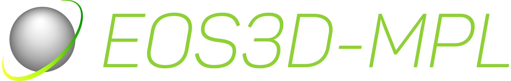

[](https://travis-ci.org/EOS3D/eos3d-mpl)
[](https://github.com/EOS3D/eos3d-mpl/releases)
[](https://www.python.org)
[](https://github.com/EOS3D/eos3d-mpl/blob/master/LICENSE)

<!--  -->

The eos3d-mpl library is a lightweight orbital mechanics calculation and visualization suite based on matplotlib.
It includes orbit visualization, SPACETRACK Two-Line Element retrieval and current satellite position visualization,
Solar System orbits and planetary position visualizations and real-time n-body simulations.

## Installation

eos3d-mpl runs on Python3 versions starting from 3.4 and requires the following libraries for full functioning:

+ ``matplotlib``
+ ``scipy``
+ ``numpy``
+ ``pandas``
+ ``pycurl`` (otional for getTLE)
+ ``python-sgp4`` (optional for SGP4 propagation)

For quick installation use the following ``pip`` command:

```sh
$ pip install matplotlib pandas scipy numpy pycurl sgp4
```

## Quick start

For starters, a simple orbit can be created using the following command:

```python
from eos3dmpl import eos_core

# Initialize Eos class and viewport
eos = eos_core.Eos()
eos.view_init()

# Add orbit with semi-major axis of 10000 km, eccentricy of 0.2 and inclination of 30 degrees
eos.orbit(a=10000,e=0.2,i=30)

# Add previous orbit to viewport and view result
eos.kepler()
eos.view()
```

Many more examples can be found in the attached Jupyter notebook (WIP).

## Further reading

For more in-depth information on eos3d-mpl, be sure to check out the ``docs/documentation.pdf`` file (still a work-in-progress).

**NOTE**: The documentation refers to eos3d-mpl as EOS, as it was envisioned to be the final form of the library at the time. Now, however, an OpenGL python3-based implementation of the library, with extended capabilities, is being developed. Its name is slated to be EOS3D.

An exhaustive documentation page is planned in the future.
